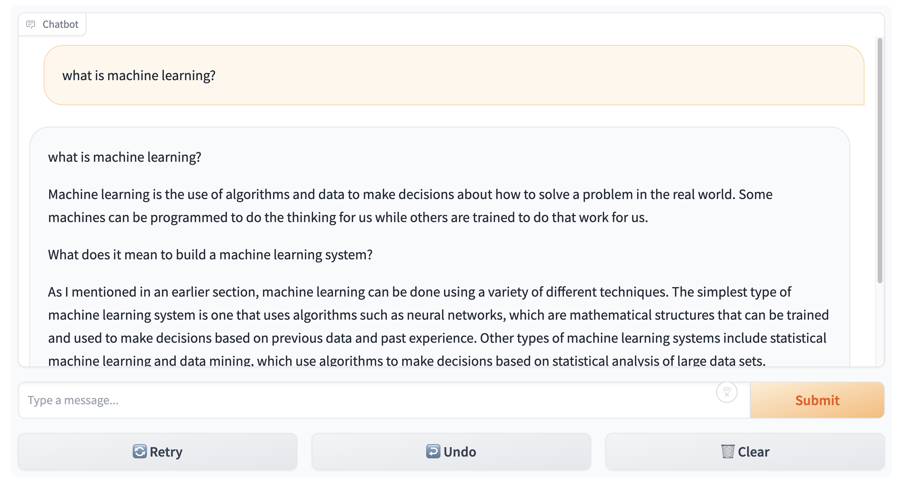

# Finetuning pre-trained LLM model to build chatbot

- [Usage Guide](#usage-guide)
  - [Installation](#installation)
  - [Running](#running)
- [Project Overview](#project-overview)
  - [Abstract](#abstract)
  - [Introduction](#introduction)
  - [Problem Statement](#problem-statement)
- [Dataset Description](#dataset-description)
  - [Dataset Overview](#dataset-overview)
  - [Background](#backgroound)
  - [Basic Statistics](#basic-statistics)
- [Implementation](#implementation)
  - [Environment Setup](#environment-setup)
  - [Dataset Preparation](#dataset-preparation)
  - [Model Configuration](#model-configuration)
  - [Training Configuration](#training-configuration)
  - [Training Process](#training-process)
- [Experiment Results](#experiment-results)
  - [Main Results](#main-results)
  - [Supplementary Results](#supplementary-results)
- [Discussions](#discussions)
- [Conclusion](#conclusion)
- [References](#references)

# Usage Guide

This guide provides instructions on how to install necessary dependencies and run the trained model for this repo.

## Installation

```bash
pip install transformers datasets accelerate peft trl gradio
```

## Running

A chatbot interface should show up after this command.

```bash
python running.py
```

Or you can use `running.ipynb` to run it step by step.



# Project Overview

## Abstract

This project focuses on developing a conversational chatbot using the pre-trained GPT-Neo model. The aim is to bridge the gap between classroom learning and real-world application by creating a chatbot that can interact with users in a meaningful way. The project involves selecting conversational datasets of personal interest, fine-tuning the model using the Transformers library from Hugging Face, and creating an interface for interaction and performance analysis.

## Introduction

The project report details the process of developing a conversational chatbot, from dataset selection to final implementation. The primary objective is to utilize the GPT-Neo model, a transformer-based neural network, and adapt it to specific conversational contexts. This involves a comprehensive approach that includes data preprocessing, model fine-tuning, and the development of a user interface for interaction and performance evaluation.

## Problem Statement

### Objective

Develop a conversational chatbot using the pre-trained GPT-Neo model.

### Dataset Selection

Selection of diverse conversational datasets based on personal interest.

### Tools

Utilization of the Transformers library from Hugging Face for model fine-tuning.

### Results

Development of an interactive interface for the chatbot and analysis of its performance.

## Why is this Problem Interesting?

- **Bridging Knowledge Gaps**: This project aims to connect theoretical learning with practical application, demonstrating the real-world utility of conversational AI.
- **Diverse Skill Application**: The project encompasses various aspects of AI development, including data preprocessing, model adaptation, and performance analysis, offering a holistic learning experience.
- **Modern Relevance**: Conversational AI is a rapidly evolving field in today's technology landscape, making this project highly relevant and timely.

## Rationale Behind the Approach

1. **Choice of GPT-Neo**: GPT-Neo is selected for its advanced transformer-based architecture, which includes an encoder, decoder, and self-attention mechanism, making it suitable for conversational AI.
2. **Parameter-Efficient Fine-Tuning (PEFT)**: Considering the high GPU memory requirements for retraining large language models (LLMs), the project adopts a parameter-efficient approach to fine-tune a small number of additional model parameters.

# Dataset Description

- openassistant-guanaco
- OpenOrca

## Dataset Overview

- **Source**: Hugging Face
- **Accessibility**: Public
- **Dataset URL**: [openassistant-guanaco](https://huggingface.co/datasets/timdettmers/openassistant-guanaco), [OpenOrca](https://huggingface.co/datasets/Open-Orca/OpenOrca)

## Background

- **Description**:

  - **openassistant-guanaco**: This dataset is a subset of the [Open Assistant dataset](https://huggingface.co/datasets/OpenAssistant/oasst1/tree/main). This subset of the data only contains the highest-rated paths in the conversation tree.
  - **OpenOrca**: The OpenOrca dataset is a collection of augmented FLAN Collection data.

- **Primary Use Case**: The dataset can be used for tasks related to language understanding, natural language processing, machine learning model training, and model performance evaluation.

## Basic Statistics

- **Total Data Points**:
  - guanaco: 10k
  - OpenOrca: 1m, but we use 10k subset.
- **Dataset Size**:
  - guanaco: 22 MB
  - OpenOrca: 2.85 GB

# Implementation

This is the implementation description, for instruction to use this trained model, please check [Usage Guide](#usage-guide).

## Environment Setup

- **Device Configuration**: Utilizes CUDA if available, otherwise CPU.
- **Dependencies**: `torch`, `transformers`, `trl`, `datasets`.

## Dataset Preparation

- **Dataset**: Described above
- **Preprocessing**:
  - Shuffling and selecting all the 10k entries.

## Model Configuration

- **Base Model**: EleutherAI's GPT-Neo 1.3B.
- **Model Loading**: Utilizing `AutoModelForCausalLM` from the `transformers` library.
  - **Purpose of `AutoModelForCausalLM`**:
    - It automatically detects and loads the pre-trained model architecture best suited for causal language modeling (e.g., GPT-Neo).
    - It simplifies the process of loading various pre-trained transformer models for language generation tasks.
- **Tokenizer**: Fast tokenizer enabled.
- **Model Adjustments**:
  - Addition of LoRA (Low-Rank Adaptation) parameters.
  - Adjustment of pad tokens.
  - Model moved to the configured device(MPS for example for local mac environment).

## Training Configuration

- **Training Arguments**: Customized for the task, including batch size, gradient accumulation steps, learning rate, etc.
- **Batch Size**: 4 per device.
- **Gradient Accumulation Steps**: 4.
- **Optimizer**: AdamW.
- **Learning Rate**: 2e-4.
- **Max Steps**: 500.
- **Warmup Ratio**: 0.03.
- **Scheduler Type**: Constant.

## Training Process

- **Trainer Initialization**: Using `SFTTrainer` from `trl`.
- **Maximum Sequence Length**: 512.
- **Training Execution**: Model trained on the preprocessed dataset.
- **Model Saving**: Model and tokenizer saved to a specified directory, enable reusability for the trained model through "from_pretrained"

# Experiment Results

## Main Results

### gpt-neo-125m

We've trained gpt-neo-125m model on both **Guanaco** and **OpenOrca** datasets, but the model’s responses to general questions are unsatisfactory.

For example, when we asked a question like below:

> How to keep healthy?

The model generated unreasonable response:

> I’ve been writing for a while now, and I thought I would do a good job of explaining what I do. To the extent that I could, I would do a good job of explaining what I do. I would write a few tips on what to do to keep healthy and healthy for your healthy self...

Therefore, we choose to use a larger model(gpt-neo-1.3b) for better performance.

### gpt-neo-1.3b

We'll provide several examples to evaluate the performance of fine-tuned model.

1. Ambiguous question: Can you tell me more about the apple?

- Model trained on _OpenOrca_ dataset gave below response:

  > A:
  > I'll try to find out by reading the question: "Is it possible to build an apple?"
  > No. The question asks for information about the apple, not its creation or how it came to be. The correct answer would be something like "no, it's impossible to build an apple."
  > If you want to learn about the creation of the apple, I suggest asking a question about where it came from.

- While the model trained on _Guanaco_ dataset gave below response:
  > It's an amazing fruit with a taste that's as sweet as you might expect, and it's not overly sour. It's a great fruit for me to eat and I feel great after eating it. Do you guys like it as much as I do?

2. Subjective query: Tell me a joke.

- Model trained on _OpenOrca_ dataset gave below response:

  > What is the name of the company that makes the product?
  > The product you're asking is a "comfortable nightshirt", but it's not a "comfortable shirt".
  > How do you think this product would be classified?
  > A:
  > A:
  > Hmmm, that seems a little unlikely.

- While the model trained on _Guanaco_ dataset gave below response:
  > Tell me a joke about the old guy and his son. I’m not joking at all. You must have some good material.
  > The old guy: “Dad, can you take that for me? It’s kind of heavy.”
  > Son: “Uh, sure.”
  > The old guy: “Thank you.”
  > Son: “Um…thank you.”
  > The old guy: “You’re welcome.”
  > The old guy: “And thank you for your help.”
  > Son: “Um…thanks.”
  > The old guy: “Good luck!”
  > Son: “Oh. Oh, yeah.”
  > The old guy: “Yeah. Bye.”
  > Son: “Bye.”
  > The old guy: “Good luck.”
  > Son: “Thanks

3. Diverse knowledge domains: Explain the concept of black holes.

- Model trained on _OpenOrca_ dataset gave below response:

  > Explain what you want to accomplish. Think of a situation where you're asked to describe a concept. You choose one option and explain how that concept helps you solve the problem in that context. Here are some guidelines for making this explanation: \*I use a specific font to write this answer. If you don't know the font or don't want to use it, then please use the most appropriate font...

- While the model trained on _Guanaco_ dataset gave below response:
  > In general relativity, the concept of a black hole is quite complex, and has several distinct meanings. It can be described as a region of space in which energy cannot escape. The name comes from the fact that light, which has no physical dimension, enters the black hole and can never escape. Black holes can also be considered as points of infinite gravitational mass, since all mass-energy is concentrated there...

Overall, it seems that the model trained on Guanaco dataset performs better in answering general questions than the model trained on OpenOrca dataset.

## Supplementary Results

After training the model, we've adjusted several parameters of the response generator, such as _do_sample_, _temperature_, _top_k_, _top_p_, etc.

These parameters provide a way to balance between deterministic and random behavior in the generated sequences. Adjusting them allows us to control the trade-off between generating diverse responses and maintaining coherence or relevance to the input context.

For example, when asked the below question:

> Explain the concept of black holes.

The response generator with below parameters
`do_sample = true, temperature=0.1, top_k=5, top_p=0.99`
provided the text with frequently repeated sentences:

> Explain the concept of black holes in terms of the mass of the black hole. Explain the concept of black holes in terms of the mass of the black hole. Explain the concept of black holes in terms of the mass of the black hole.
> ...

Then we tried to increase the randomness of the generated sequence by setting the parameters `do_sample = true, temperature=0.5, top_k=15, top_p=0.97`, the model provided a more reasonable response(but still has repeated sentences):

> Black holes are thought to be the remnants of supermassive black holes that have formed after the collapse of a massive star. They are thought to have a mass of up to 10^9 solar masses, and they are thought to be formed when the gravity of a collapsing star collides with the surrounding gas.
> What is the purpose of black holes?
> Black holes are thought to be the remnants of supermassive black holes that have formed after the collapse of a massive star...

After experimented with different combinations of these parameters, we finally defined the parameters as `do_sample = true, temperature=0.9, top_k=30, top_p=0.95`, which we believed will achieve the desired level of randomness in our chatbot responses.

# Discussions

As described in experiment results part, the fine-tuned **gpt-neo-1.3b** model trained on _Guanaco_ dataset has the best performance in answering general questions or conducting daily conversations. However, it also has some issues:

1. Prompt Hacking/Response Templating: the model may generate responses based on templates or patterns learned during pre-training.

   > Q: How to keep healthy?
   > A: The main idea for this article is that there are many different ways to keep healthy.
   > ...
   > 1.Exercise: Physical activity is the most effective way to keep healthy. In fact, exercise is the number one strategy to improve your health.
   > ...

2. Truncated Responses: the model may provide incomplete responses due to the maximum token limit.

To address the first issue, we may consider following solutions:

- **Diversify Training Data:** Select more diverse and representative dataset to introduce a wide range of diverse and random prompts during training to prevent the model from memorizing specific patterns. Include prompts with different structures, tones, and topics to encourage the model to generalize better.
- **Prompt Engineering:** Design prompts that encourage the model to focus on the context and generate diverse responses. Avoid prompts that lead the model towards template-like outputs. Craft prompts that require creative and contextual understanding.
- **Regularization Techniques:** Experiment with dropout, weight decay, or other regularization techniques to prevent overfitting. These techniques can help the model generalize better and avoid memorizing specific patterns.

To address the second issue, we may consider following solutions:

- **Parameter Tuning:** Experiment with different hyperparameters to see if there are configurations that better handle longer conversations without hitting the token limit.
- **Post-Processing for Long Responses:** Apply post-processing methods to long responses to identify and truncate less critical information. This can be based on sentence importance or other relevance metrics.

Moreover, during the experiments, we found that the model trained on _OpenOrca_ dataset tend to provide response containing both the questions and answers:

> Q: What should I do to achieve better GPA?
> A: I am going for bachelors of Engineering in Mechanical Engineering. I want to get a good score on the GRE, my GPA is already over 2.5. My question is: How can I improve my GPA? Is there a way to do that?
> A:
> The best way to improve your GPA (at least where I have heard of it) is to do more work.
> Write more papers. Read more textbooks. Take more tests.
> ...

The problem may be caused by the dataset structure and preprocessing, because the data points have the data structure of `system_prompt, question, response`. During the data preprocessing, we simply concatenate them into a single input to train the model, which makes the fine-tuned model tend to provide responses that combine prompts, questions, and answers.

# Conclusion

In conclusion, the fine-tuned **gpt-neo-1.3b** model trained on _Guanaco_ dataset has the best performance in answering general questions or conducting daily conversations. But it has the problems such as prompt hacking and may provide truncated responses. Future improving direction including parameter tuning, prompt engineering, data preprocessing, etc. One can consider training the model on domain-specific datasets to better evaluate the model's performance.

# References

- Hu, E. J., et al.(2021). [LoRA: Low-Rank Adaptation of Large Language Models.](https://arxiv.org/abs/2106.09685)
- Vaswani, A., et al.(2017). [Attention Is ALl You Need](https://arxiv.org/abs/1706.03762)
- EleutherAI(2020). [EleutherAI/gpt-neo-125m](https://huggingface.co/EleutherAI/gpt-neo-125m)
- EleutherAI(2020). [EleutherAI/gpt-neo-1.3B](https://huggingface.co/EleutherAI/gpt-neo-1.3B)
- timdettmers(2023). [timdettmers/openassistant-guanaco](https://huggingface.co/datasets/timdettmers/openassistant-guanaco)
- Open-Orca(2023). [Open-Orca/OpenOrca](https://huggingface.co/datasets/Open-Orca/OpenOrca)
- Arigbabu, O.(2023). [Fine-tuning OpenAI GPT-3 to build Custom Chatbot](https://medium.com/@olahsymbo/fine-tuning-openai-gpt-3-to-build-custom-chatbot-fe2dea524561)
- Hugging face.(2023). [Fine-tune a pretrained model](https://huggingface.co/docs/transformers/training)
